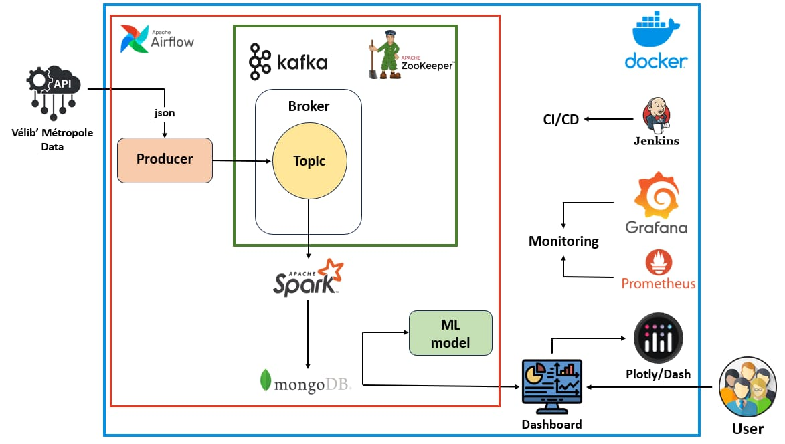

# 🚲 Velib Data Pipeline & Smart ML Platform


---

## 🧠 Présentation

> Une plateforme **intelligente**, **scalable** et **temps réel** pour l’analyse, la prédiction et la surveillance des données **Vélib’ Métropole**.

🔹 Ingestion **streaming temps réel** avec Kafka  
🔹 Traitement **Big Data** avec Spark  
🔹 Modélisation prédictive avec Spark MLlib  
🔹 Supervision et alertes modernes avec Grafana et Prometheus  
🔹 **Infrastructure dockerisée**, automatisée par Airflow & Jenkins  
🔹 Prête pour la production et l’évolution vers le cloud

---

## 🏗️ Architecture complète




## 🧰 Technologies & Services

| Composant      | Rôle |
|----------------|------|
| **🔗 API Vélib’** | Source de données temps réel |
| **💬 Kafka** | Bus d’événements pour ingestion continue |
| **🔥 Apache Spark** | Traitement distribué, transformation, ML |
| **🧠 Spark MLlib** | Entraînement & prédiction sur données vélo |
| **🍃 MongoDB** | Stockage NoSQL pour les données enrichies |
| **🛰 Airflow** | Orchestration des pipelines (ETL & ML) |
| **🛠 Jenkins** | Intégration et déploiement continus |
| **📈 Prometheus** | Monitoring système et applicatif |
| **📊 Grafana** | Dashboards dynamiques & alertes |

---

## 🚀 Démarrage rapide

### 1. Cloner le dépôt
```bash
git clone https://github.com/<USERNAME>/<REPO>.git
cd <REPO>
```

### 2. Démarrer l'infrastructure
```bash
docker-compose up --build
```

### 3. Accéder aux services

| Service         | URL                          |
|-----------------|------------------------------|
| Airflow         | http://localhost:8082         |
| Jenkins         | http://localhost:8083         |
| Kafka UI        | http://localhost:8080         |
| Mongo Express   | http://localhost:8081         |
| Prometheus      | http://localhost:9090         |
| Grafana         | http://localhost:3000         (admin/admin)

---

## 🗂 Structure du projet

```
.
├── dags/                    # Orchestration Airflow
├── Scripts/
│   ├── data-ingestion/      # Récupération via API Vélib → Kafka
│   ├── data-transformation/ # Traitement Spark Streaming
│   └── ML_model/            # Modèle ML (Spark MLlib)
├── tests/                   # Tests unitaires avec Pytest
├── docker-compose.yml       # Infrastructure multi-conteneurs
├── Jenkinsfile              # Pipeline CI/CD
├── prometheus.yml           # Config Prometheus
└── requirements.txt         # Dépendances Python
```

---

## 🔬 Tests

Exécute les tests unitaires avec :
```bash
pytest tests/
```

---

## 🧩 Fonctionnalités avancées

✅ Prédictions de disponibilité des stations Vélib  
✅ Détection des périodes de saturation ou de pénurie  
✅ Alertes en temps réel via Grafana (email / Slack possible)  
✅ Visualisation dynamique de l’occupation des stations  
✅ Monitoring complet de chaque microservice  
✅ Extensible pour d'autres jeux de données urbaines (transports, IoT...)

---

## 📦 Améliorations à venir

- ☁️ Déploiement cloud (AWS / GCP / Azure)
- 🧠 Ajout de modèles avancés (XGBoost, LSTM)
- 🌍 Dashboard géographique des stations sur Leaflet/Mapbox
- 🔒 Sécurité : Authentification sur Jenkins et Grafana
- 🧾 Logging centralisé avec ELK Stack (ElasticSearch, Logstash, Kibana)

---

## 👥 Auteurs

- **Akram33** – [akranejjari726m@gmail.com](mailto:akramnejjari726@gmail.com)  
- **Ouiame Makhoukh**  
- **Mohamed Zioud**

---

## 📜 Licence

Ce projet est distribué sous la licence MIT.

---

## 🤝 Contribuer

✨ Vous êtes les bienvenus pour contribuer ! Forkez, améliorez, proposez des pull requests !  
⭐ N'oubliez pas de laisser une étoile si ce projet vous plaît.
